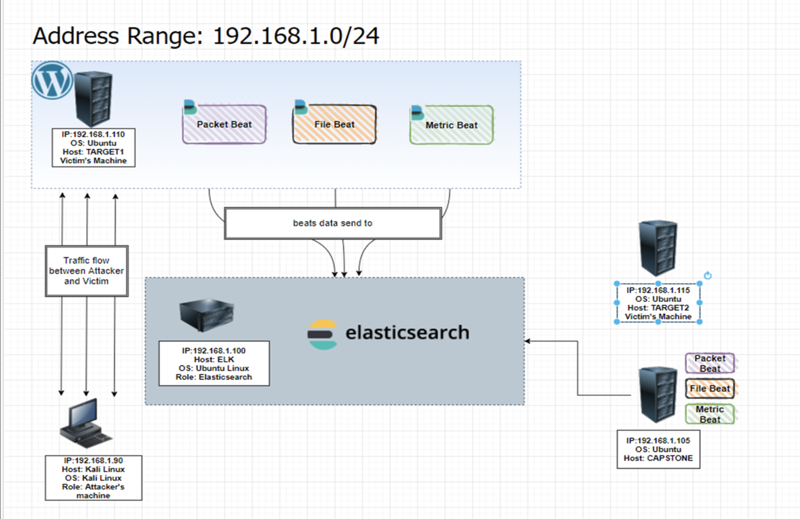
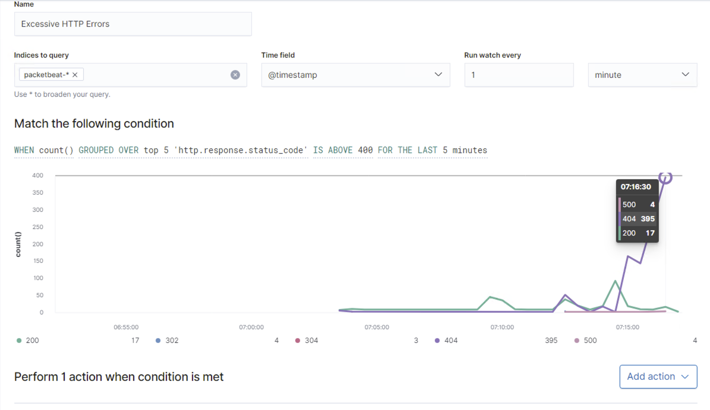
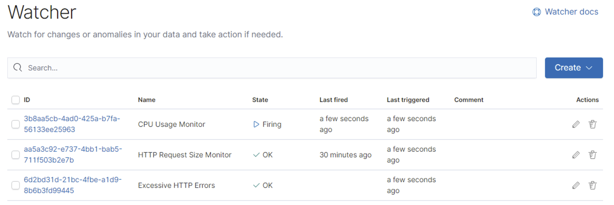
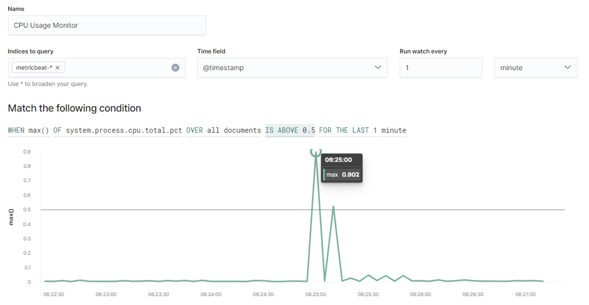
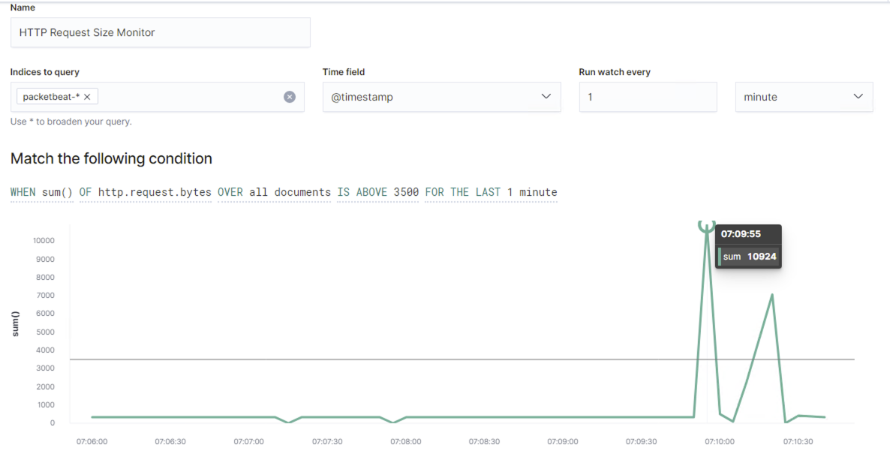

# Blue Team: Summary of Operations

## Table of Contents
- Network Topology
- Description of Targets
- Monitoring the Targets
- Patterns of Traffic & Behavior
- Suggestions for Going Further

### Network Topology

The following machines were identified on the network:
- Name of VM 1 **`Hyper V Host Manager`**  
  - **Operating System:** `Windows 10`  
  - **Purpose:** `Contains the vulnerable machines and the attacking machine`  
  - **IP Address:** `192.168.1.1`  
- Name of VM 2 **`Kali`**  
  - **Operating System:** `Linux 5.4.0`  
  - **Purpose:** `Used as attacking machine`  
  - **IP Address:** `192.168.1.90`  
- Name of VM 3 **`Capstone`**  
  - **Operating System:** `Linux (Ubuntu 18.04.1 LTS)`  
  - **Purpose:** `Used as a testing system for alerts`  
  - **IP Address:** `192.168.1.100`  
- Name of VM 4 **`ELK`**  
  - **Operating System:** `Linux (Ubuntu 18.04.1 LTS)`  
  - **Purpose:** `Used for gathering information from the victim machine using Metricbeat, Filebeats, and Packetbeats`  
  - **IP Address:** `192.168.1.100`  
- Name of VM 5 **`Target 1`**  
  - **Operating System:** `Linux 3.2 - 4.9`  
  - **Purpose:** `The VM with WordPress as a vulnerable server`  
  - **IP Address:** `192.168.1.110`

### Description of Targets

The target of this attack was: `Target 1` (192.168.1.110).

Target 1 is an Apache web server and has SSH enabled, so ports 80 and 22 are possible ports of entry for attackers. As such, the following alerts have been implemented:

### Monitoring the Targets

Traffic to these services should be carefully monitored. To this end, we have implemented the alerts below:

#### Excessive HTTP Errors

Excessive HTTP Errors is implemented as follows:
  - **Metric**: `Packetbeat:` http.response.status_code > 400
  - **Threshold**: `grouped http response status codes above 400 every 5 minutes`  
    - **`When count() GROUPED OVER top5 ‘http.response.status_code’ is above 400 for the last 5 minutes`**
  - **Vulnerability Mitigated**:  
    - Used intrusion detection/prevention for attacks  
    - IPS would block any suspicious IP’s  
    - Utilize Account Management to lock or request user accounts to change the passwords every 60 days  
    - Filter and disable or close port 22  
  - **Reliability**: This alert will not generate an excessive amount of false positives identifying brute force attacks. **`Medium`**

#### CPU Usage Monitor
CPU Usage Monitor is implemented as follows:
  - **Metric**: `Metricbeat:` system.process.cpu.total.pct
  - **Threshold**: The maximum cpu total percentage is over .5 in 5 minutes  
    - **`WHEN max() OF system.process.cpu.total.pct OVER all documents IS ABOVE 0.5 FOR THE LAST 5 minutes`**  
  - **Vulnerability Mitigated**: Controlling the CPU usage percentage at 50%, it will trigger a memory alert only if the CPU remains at or above 50% consistently for 5 minutes. Virus or Malware
  - **Reliability**: Yes, this alert can generate a lot of false positives due to CPU spikes occurring when specific integrations are initiated at the start of processing. **`High`**  
  
  
#### HTTP Request Size Monitor
HTTP Request Size Monitor is implemented as follows:
  - **Metric**: `Packetbeat:` http.request.bytes
  - **Threshold**: The sum of the requested bytes is over 3500 in 1 minute
    - **`When sum() of http.request.bytes OVER all documents is ABOVE 3500 for the LAST 1 minute`**
  - **Vulnerability Mitigated**: By controlling the number of http request sizes through a filter, protection is enabled to detect or prevent DDOS attacks for IPS/IDS.
  - **Reliability**: No, this alert doesn't generate an excessive amount of false positives because DDOS attacks submit requests within seconds, not within minutes. **`Medium`**
  
  

### Suggestions for Going Further (Optional)

The logs and alerts generated during the assessment suggest that this network is susceptible to several active threats, identified by the alerts above. In addition to watching for occurrences of such threats, the network should be hardened against them. The Blue Team suggests that IT implement the fixes below to protect the network:
- Enumeration and Brute Force Attacks
  - **Patch**: WordPress Hardening
    - Lock out accounts after a predetermined number of failed attempts and implement multi-factor authentication (MFA).
    - Disable the WordPress REST API and XML-RPC if it’s not needed and configure the web server to block requests to /?author=<number>.
    - Prohibit exposure of /wp-admin and /wp-login.php.

  - **Why It Works**:
    - Account lock outs will mitigate credential stuffing and multi-factor authentication will mitigate password spraying attacks.
    - WPScan uses REST API to enumerate users, and XML-RPC uses HTTP as its transport mechanism for data.
    - WordPress permalinks can be set to include an author and preventing exposure of WordPress login portals will help mitigate brute force attacks.

- Code Injection in HTTP Requests (XSS and CRLF) and DDOS
  - **Patch**: Code Injection/DDOS Hardening
    - Implementation of HTTP Request Limit on the web server.
    - Implementation of server-side input validation to prevent malicious scripts from being stored on the web server.
    - Implementation of client-side input validation to prevent input of malicious scripts.

  - **Why It Works**:
    - If an HTTP request URL length, query string and over size limit of the request a 404 range of errors will occur.
    - Input validation can help protect against malicious data a malicious actor attempts to send to the server via the website or application in a HTTP request.

- Malicious Code (Malware and Viruses) and Resource Utilization
  - **Patch**: Malware Hardening
    - Implementation of Antivirus software
    - Implementation of a Host Based Intrusion Detection System (HIDS)

  - **Why It Works**:
    - Antivirus software is effective in detection and removal of malicious threats against computers and a robust security option in general which should be layered into a Defense in Depth approach to Cyber Security.
    - Host Based Intrusion Detection Systems monitor and analyze the entire file system of a host system and generate alerts if baseline deviation is detected.  

### Submitted By - Aziz Somani