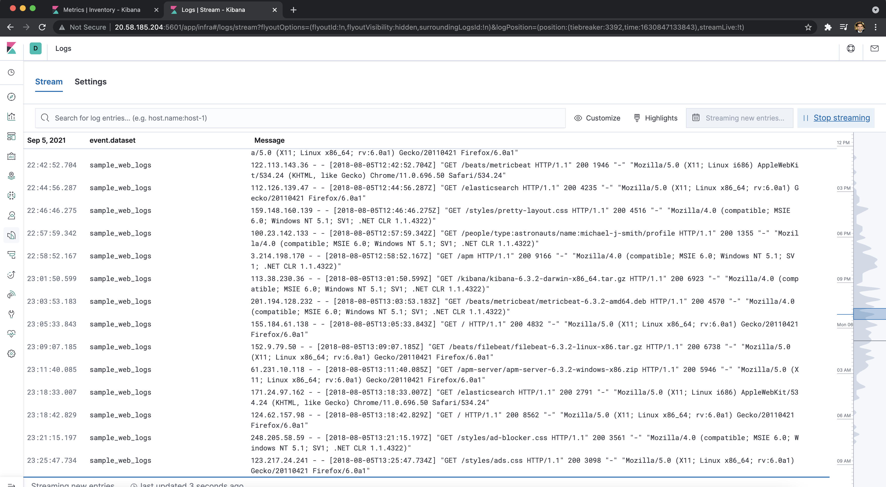

**Kibana - Continued**

### SSH Barrage

Task: - Generate a high amount of failed SSH login attempts and verify that Kibana is picking up this activity.

Follow Below Steps to finish task: - 

1.	Log into your Jump Box.
    -	Run: `ssh username@IP-OF-WEB-VM`

Note – This should give an error saying Permission denied (publickey) because you are not in container of jump-box and this error was also logged and sent to Kibana.

2.	Run the failed SSH command in a loop to generate failed login log entries.
    -	Run: `username@Jump-Box-Provisioner:~$ for i in {1..1000}; do ssh sysadmin@10.0.0.5; done`

    Note - Hit CTRL + c to exit from loop.

    -	Syntax Breakdown:
    -	`for` begins the for loop.
    -	`i in` creates a variable named `i` that will hold each number `in` our list.
    -	`{1..1000}` creates a list of 1000 numbers, each of which will be given to our `i` variable.
    -	`;` separates the portions of our `for` loop when written on one line.
    -	`do` indicates the action taken each loop.
    -	`ssh sysadmin@10.0.0.5` is the command run by `do`.
    -	`;` separates the portions of our for loop when it's written on one line.
    -	`done` closes the `for` loop.


3.	 Search through the logs in Kibana to locate your generated failed login attempts.
    -	Run: `username@Jump-Box-Provisioner:~$ while true; do ssh username@10.0.0.5; done`

    Note - Hit CTRL + c to exit from loop.

    -	Syntax Breakdown:
    -	`while` begins the while loop.
    -	`true` will always be equal to `true` so this loop will never stop, unless you force quit it.
    -	`;` separates the portions of our `while` loop when it's written on one line.
    -	`do` indicates the action taken each loop.
    -	`ssh sysadmin@10.0.0.5` is the command run by `do`.
    -	`;` separates the portions of our `for` loop when it's written on one line.
    -	`done` closes the `for` loop.

4.	Create a nested loop that generates SSH login attempts across all 3 of your VM's.
    -	Run: `username@Jump-Box-Provisioner:~$ while true; do for i in {5..7}; do ssh sysadmin@10.0.0.$i; done; done`

    - Syntax Breakdown:
    - `i in` creates a variable named `i` that will hold each number `in` our list.
    - `{5..7}` creates a list of numbers (5, 6 and 7), each of which will be given to our `i` variable.
    - `do` indicates the action taken each loop.
    - `ssh sysadmin@10.0.0.$i` is the command run by `do`. It is passing in the `$i` variable so the `wget` command will be run on each server.


 


### Linux Stress

Task: Generate a high amount of CPU usage on the pen-testing machines and verify that Kibana picks up this data.

Follow Below Steps to finish task: - 

1. Login in to your Jump-Box, start up your `Ansible` container and attach to it.

2. SSH from your Ansible container to one of your WebVM's.

3. Run `sudo apt install stress` to install the stress program.

4. Run `sudo stress --cpu 1` and allow stress to run for a few minutes. 

5. Check out the Metrics page for that VM in Kibana. 

   Below is the link of image showing CPU usage increase: -  


### wget-DoS

Task: Generate a high amount of web requests to your pen-testing servers and make sure that Kibana is picking them up.

Follow Below Steps to finish task: -

1. Login in to your Jump-Box.

2. Run: - `wget ip-of-web-vm`

	```bash
	username@Jump-Box-Provisioner:~$ wget 10.0.0.5
	--2021-04-09 12:55:00--  http://10.0.0.5/
	Connecting to 10.0.0.5:80... connected.
	HTTP request sent, awaiting response... 302 Found
	Location: login.php [following]
	--2021-04-09 12:55:00--  http://10.0.0.5/login.php
	Reusing existing connection to 10.0.0.5:80.
	HTTP request sent, awaiting response... 200 OK
	Length: 1523 (1.5K) [text/html]
	Saving to: ‘index.html’

	index.html            100%[=======================>]   1.49K  --.-KB/s    in 0s      

	2021-04-09 12:55:00 (179 MB/s) - ‘index.html’ saved
	```

3. Run `ls` to view the file you downloaded from your web vm to your jump-box:

	```bash
	username@Jump-Box-Provisioner:~$ ls
	index.html
	```

4. Run the `wget` command in a loop to generate a ton of web requests.
    
    **for loop:**
    -	Run: `Run username@Jump-Box-Provisioner:~$ for i in {1..1000}; do wget 10.0.0.5; done`

        Note - Hit CTRL + c to exit from loop.

		- Syntax Breakdown:
		- `{1..1000}` creates a list of 1000 numbers, each of which will be given to our `i` variable.
		- `;` separates the portions of our `for` loop when it's written on one line.
		- `do` is what each iteration of the loop will do.
		- `do wget 10.0.0.5` is the command run by with each loop.


	- **while loop:**
    -	Run: `username@Jump-Box-Provisioner:~$ while true; do wget 10.0.0.5; done`
    
        Note - Hit CTRL + c to exit from loop.


5. Open the `Metrics` page for the web machine you attacked and answer the following questions:
	
	- Which of the VM Metrics was affected the most from this traffic?

	- **Answer:** The Load and Networking Metrics were hit:

	   