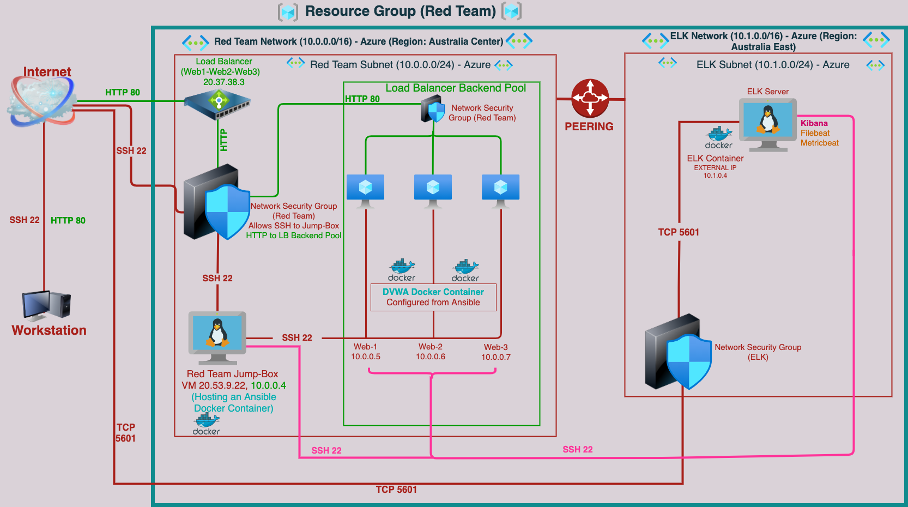
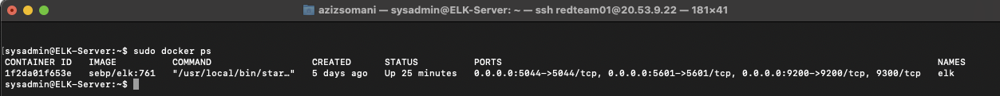

## Automated ELK Stack Deployment

### Overview
This document contains the following details:
- Description of the Topology
- Access Policies
- ELK Configuration
  - Beats in Use
  - Machines Being Monitored
- How to Use the Ansible Build

These files have been tested and used to generate a live ELK deployment on Azure. They can be used to either recreate the entire deployment pictured above. Alternatively, select portions of the **_playbook.yml_, _Configuration_ and _host__** file may be used to install only certain pieces of it, such as Filebeat.

**Playbook file**
- [Ansible Playbook](Ansible/DVWA/dvwa_container.yml)
  (To Configure docker.io, Install pip3, Install Docker python module and download and launch a docker cyberxsecurity/dvwa container on WEB1, WEB2 & WEB3)
- [Ansible Hosts file](Ansible/hosts)
- [Ansible Configuration file](Ansible/Ansible-Cfg/ansible.cfg)
- [ELK Server Configuration Playbook](Ansible/ELK/install-elk.yml)
- [Ansible Filebeat Playbook](Ansible/Filebeat/filebeat-playbook.yml)
- [Ansible Filebeat Configuration file](Ansible/Filebeat/filebeat-configuration.yml)
- [Ansible Metricbeat Playbook](Ansible/Metricbeat/metricbeat-playbook.yml)
- [Ansible Metricbeat Configuration file](Ansible/Metricbeat/metricbeat-configuration.yml)


### Description of the Topology

This repository includes code defining the infrastructure below.




The main purpose of this network is to expose a load-balanced and monitored instance of DVWA, the D*mn Vulnerable Web Application.

1) Load balancing ensures that the application will be highly **_high availability and reliability by sending requests only to servers that are online____**, in addition to restricting _**inbound access**_ to the network.
  i) What aspect of security do load balancers protect?
    - The load balancer ensures that work to process incoming traffic will be shared by both vulnerable web servers. Access controls will ensure that only authorized users — namely, ourselves — will be able to connect in the first place.
         
  ii) What is the advantage of a jump box?
    - Jump box prevents all Azure VMs to expose to the public internet, and that means it's entry point connecting via Remote Desktop Protoco - RDP from our on premise network, and It also helps to open only one port instead of several ports to connect different virtual machines present in the Azure cloud.

2) Integrating an ELK server allows users to easily monitor the vulnerable VMs for changes to the __**file systems of the VMs on the network**___ and system __**metrics**___.
  i) What does Filebeat watch for?
    - Filebeat is a lightweight shipper for forwarding and centralizing log data, and filebeat installed as an agent on servers. Filebeat monitors the log files or locations that specify by user and collects log events, forwards them either to Elasticsearch or Logstash for indexing.___

  ii) What does Metricbeat record?
    - Gathers the metrics and statistics that it collects and sends them a specified output such as Elasticsearch or Logstash.

The configuration details of each machine may be found below.

| Name     |   Function  | IP Address               | Operating System |
|----------|-------------|--------------------------|------------------|
| Jump Box | Gateway     | 10.0.0.4 | 20.53.9.22    | Linux            |
| DVWA 1   | Web Server  | 10.0.0.5                 | Linux            |
| DVWA 2   | Web Server  | 10.0.0.6                 | Linux            |
| ELK      | Monitoring  | 10.1.0.4 | 20.58.185.204 | Linux            |

Also to above both webserver have provisioned a **Load Balance** in front webservers except didn't setup for the Jump Box.
Below are follwing availability zones organised for the load balancer's targets and server redundency has been set-up for Web1 and Web2 VMs.

| Name     | Availability Zone    | IP Address |
|----------|----------------------|------------|
| DVWA 1   | Availability Zone 1  | 10.0.0.5   |
| DVWA 2   | Availability Zone 1  | 10.0.0.6   |
| ELK      | Availability Zone 2  | 10.0.0.6   |

## ELK Server Configuration
The ELK VM exposes an Elastic Stack instance and **Docker** is used to download and manage an ELK container.

Rather than configure ELK manually, we opted to develop a reusable Ansible Playbook to accomplish the task. This playbook is duplicated below.

To use this playbook, one must log into the Jump Box, then issue: `ansible-playbook install_elk.yml elk`. This runs the `install_elk.yml` playbook on the `elk` host.


### Access Policies

The machines on the internal network are not exposed to the public Internet. 

Only the _**jump box**__ machine can accept connections from the Internet. Access to this machine is only allowed from the following IP addresses `20.53.9.22`.

Machines within the network can only be accessed by _ **each other**_.
- Which machine did you allow to access your ELK VM? 
  - The DVWA 1 and DVWA 2 VMs send traffic to the ELK server.
- What was its IP address?_
  - IP address are DVWA 1: 10.1.0.5 & DVWA 1: 10.1.0.6.

A summary of the access policies in place can be found in the table below.

| Name       | Publicly Accessible   | Allowed IP Addresses     |
|------------|-----------------------|--------------------------|
| Jump Box   | Yes                   | 122.110.57.182           |
| DVWA 1     | No, only via Jump Box | 10.1.0.4/24              |
| DVWA 2     | No, only via Jump Box | 10.1.0.4/24              |
| ELK        | No, only Monitoring   | 10.1.0.4 | 20.58.185.204 |


### Elk Configuration

Ansible was used to automate configuration of the ELK machine. No configuration was performed manually, which is advantageous because.
- What is the main advantage of automating configuration with Ansible?_
  - The main advantage of Ansible is it allows IT administrators to automate away the drudgery from their daily tasks and it provides a stable environment for the development and operations team and that frees them to focus on efforts that help deliver more value to the business by spending time on more important tasks.

The playbook implements the following tasks:
- In 3-5 bullets, explain the steps of the ELK installation play. E.g., install Docker; download image; etc._
  - Install docker.io
  - Install pip3
  - Install Docker python module
  - Increase memory
  - Download and launch a docker elk container on ports :- 5601:5601, 9200:9200, 5044:5044
  - Enable service docker on boot

The following screenshot displays the result of running `docker ps` after successfully configuring the ELK instance.



Below is the playbook yml file.

```yaml
---
# install_elk.yml
- name: Configure Elk VM with Docker
  hosts: elkservers
  remote_user: elk
  become: true
  tasks:
    # Use apt module
    - name: Install docker.io
      apt:
        update_cache: yes
        name: docker.io
        state: present

      # Use apt module
    - name: Install pip3
      apt:
        force_apt_get: yes
        name: python3-pip
        state: present

      # Use pip module
    - name: Install Docker python module
      pip:
        name: docker
        state: present

      # Use command module
    - name: Increase virtual memory
      command: sysctl -w vm.max_map_count=262144

      # Use sysctl module
    - name: Use more memory
      sysctl:
        name: vm.max_map_count
        value: "262144"
        state: present
        reload: yes

      # Use docker_container module
    - name: download and launch a docker elk container
      docker_container:
        name: elk
        image: sebp/elk:761
        state: started
        restart_policy: always
        published_ports:
          - 5601:5601
          - 9200:9200
          - 5044:5044
      
      # Use systemd module
    - name: Enable service docker on boot
      systemd:
        name: docker
        enabled: yes
```


### Target Machines & Beats
This ELK server is configured to monitor the following machines:
- List the IP addresses of the machines you are monitoring_
  - The DVWA 1 and DVWA 2 VMs, at `10.0.0.5` and `10.0.0.6`, respectively.

We have installed the following Beats on these machines:
- Specify which Beats you successfully installed_
  - Filebeat
  - Metricbeat

These Beats allow us to collect the following information from each machine:
- In 1-2 sentences, explain what kind of data each beat collects, and provide 1 example of what you expect to see. E.g., `Winlogbeat` collects Windows logs, which we use to track user logon events, etc._
- **Filebeat**: Filebeat helps generate and organize log files to send to Logstash and Elasticsearch. Specifically, it logs information about the file system, including which files have changed and when, and filebeat is often used to collect log files from very specific files, such as those generated by Apache, Microsoft Azure tools, the Nginx web server, and MySQL databases.
 **Metricbeat**: Metricbeat collects ships various system-level metrics for various systems and platforms and metricbeat also supports internal modules for collecting statistics from specific platforms, we can configure the frequency by which Metricbeat collects the metrics and what specific metrics to collect using these modules and sub-settings called metricsets.

Below are the yml file for both filebeat and metricbeat and as well host file.

- [Ansible Hosts file](Ansible/hosts)
- [Ansible Filebeat Playbook](Ansible/filebeat-playbook.yml)
- [Ansible Metricbeat Playbook](Ansible/metricbeat-playbook.yml)

### Using the Playbook
In order to use the playbook, you will need to have an Ansible control node already configured. Assuming you have such a control node provisioned: 

SSH into the Jump Box and follow the steps below:
- Log into the Jump Box.
- Start and attach to an Ansible container. 
- Change directory to ‘/etc/ansible’.

SSH into the control node and to use the playbooks, we must perform the following steps:
- Copy the playbooks to the Ansible Control Node
- Run each playbook on the appropriate targets

The easiest way to copy the playbooks is to use Git:
```bash
$ cd /etc/ansible
$ mkdir files
# Clone Repository + IaC Files
$ git clone https://github.com/user_name_of_account/project-1.git
# Move Playbooks and hosts file Into `/etc/ansible`
$ cp Project-1/Ansible/hosts /etc/ansible
$ cp Project-1/Ansible/Ansible-Cfg/ansible.cfg /etc/ansible
$ cp Project-1/Ansible/Filebeat/filebeat-playbook.yml /etc/ansible
$ cp Project-1/Ansible/Filebeat/filebeat-configuration.yml /etc/ansible
$ cp Project-1/Ansible/Metricbeat/metricbeat-playbook.yml /etc/ansible
$ cp Project-1/Ansible/Metricbeat/metricbeat-configuration.yml /etc/ansible
```

Next, you must edit the `hosts` file to specify which VMs to run each playbook on and make sure the `hosts` file is updated to include the ELK server.

```bash
$ $ cd /etc/ansible
$ cat > hosts <<EOF

[webservers]
10.0.0.9 ansible_python_interpreter=/usr/bin/python3
10.0.0.7 ansible_python_interpreter=/usr/bin/python3
10.0.0.8 ansible_python_interpreter=/usr/bin/python3

[elk]
10.1.0.4 ansible_python_interpreter=/usr/bin/python3
EOF
```

also Edit the Ansible Configuration file.
once you are in container of jumb box, go to /etc/ansible and nano ansible.cfg

```- root@1b4a488b36cb:/etc/ansible# curl -L -O https://ansible.com/  > ansible.cfg
- root@1b4a488b36cb:/etc/ansible# nano ansible.cfg

- Press CTRL + W (to search > enter remote_user then change `remote_user = azureuser`
```

**Where : `azureuser` is the remote user that has control over ansible.**


After this, the commands below run the playbook:

 ```bash
 $ cd /etc/ansible
 $ ansible-playbook install_elk.yml elk
 $ ansible-playbook install_filebeat.yml webservers
 $ ansible-playbook install_metricbeat.yml webservers
 ```

Once everything done, wait five minutes to give ELK time to start up and to verify success run: `curl http://10.0.0.8:5601`. This is the address of Kibana.
 If the installation succeeded, this command should print HTML codes to the console.

 Please below specific commands user need to run to setup, download playbook, update files and check status.
 
Commands                                    | Description of Commands
-------------------------------------------------------------------------------------------------------------
| 1) ssh username@PublicIP                    | ssh to jump-box from home |
| 2) sudo docker container list -a	          | lists all docker container |
| 3) sudo docker start eager_golick           | start docker container eager_golick |
| 4) sudo docker ps	                          | list docker containers that are running |
| 5) sudo docker attach eager_golick	        | attaches you to the container |
| 6) cd /etc/ansible	                        | Change directory to the Ansible directory |
| 7) ls -la	                                  | List all file in directory |
| 8) nano hosts	                              | add webservers and elf machines |
| 9) nano ansible.cfg		                      | add user name to remote user |
| 10) nano pentest.yml			                  | write YAMl file to install docker and DVWA on webservers |
| 11) ansible-playbook pentest.yml			          | run playbook to install docker and DVWA container n webservers |
| 12) ssh username@10.0.0.5		                    | ssh to Web-1 |
| 13) sudo docker ps		                          | check to make sure teh container is installed and running |
| 14) logout			                                | exit out of Web-1 back to Jump-box |
| 15) nano install-elk.yml		                    | write YAML file to install docker and ELK stack on ELK VM |
| 16) ansible-playbook install-elk.yml		        | run playbook to install docker and ELK stack on ELK VM |
| 17) ssh username@10.1.0.4		                    | ssh to ELK VM |
| 18) sudo docker ps		                          | check that the ELK container is installed and running |
| 19) logout			                                | exit ELK VM back to Jump-Box |
| 20) nano filebeat-config.yml  		              | create and edit filebeat config file |
| 21) nano filebeat-playbook.yml		              | write YAML file to install filebeat on webservers |
| 22) ansible-playbook filebeat-playbook.yml	    | run playbook to install filebeat on webservers |
| 23) http://(ELK-PublicIP:5601/app/kibana         |	Open web browser and navigate to logs - add log data - system logs click on check data. click on system logs dashboard |
| 24) nano metricbeat-config.yml	                | create metricbeat config file and edit it |
| 25) nano metricbeat-playbook.yml	              |	write YAML file to install metricbeat on webservers |
| 26) ansible-playbook metricbeat-playbook.yml	  |	run playbook to install metricbeat on webserers |
| 27) http://(ELK-PublicIP:5601/app/kibana	        |	Open web browser and navigate to metric data - docker metrics - click on teh check data, click on Docker Metric dashboard |

------

 Project: - 1, Completed by Aziz Somani